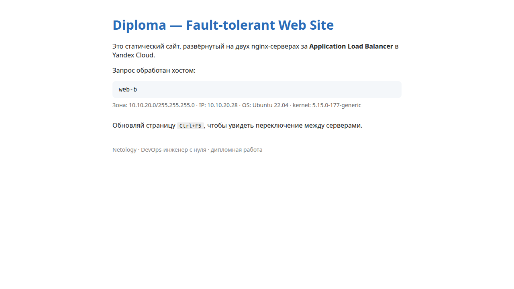
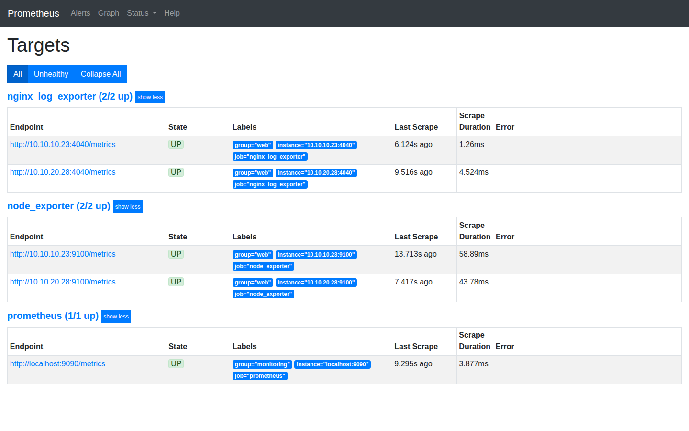
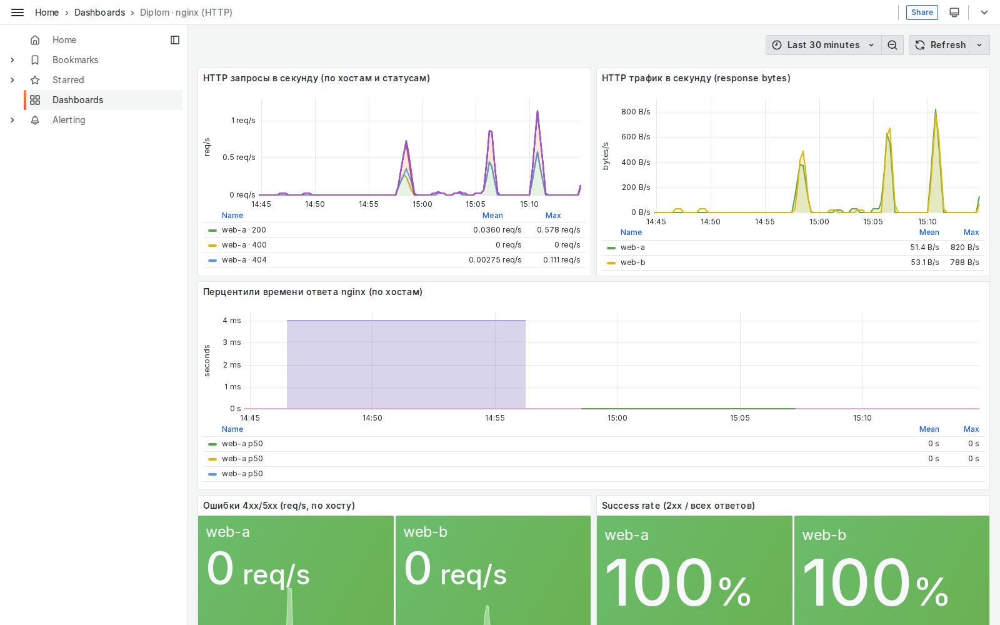
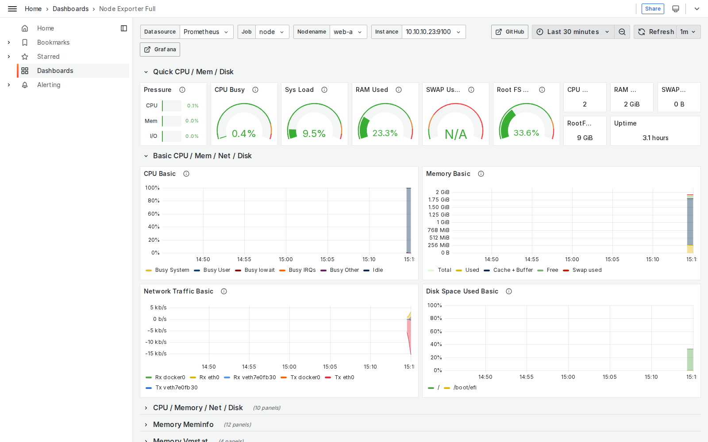
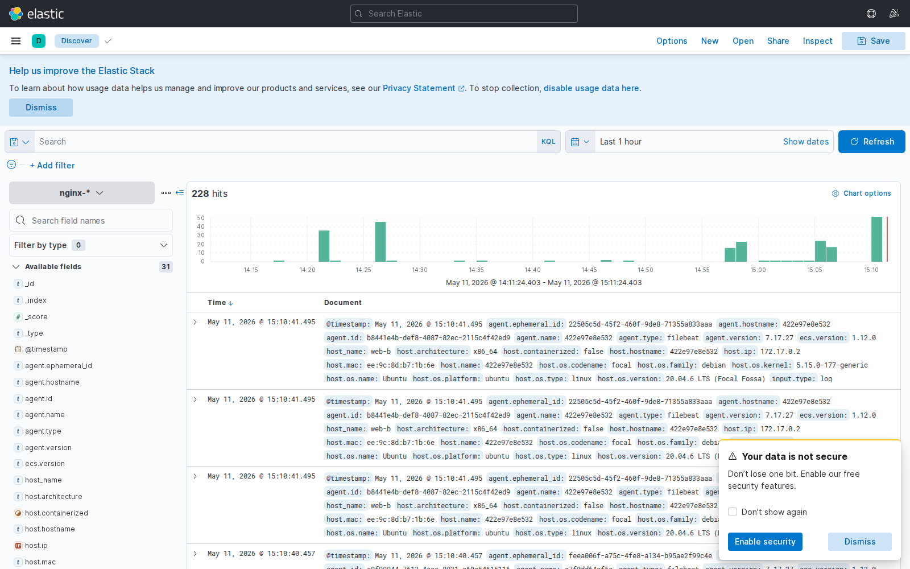

# Дипломная работа: DevOps-инженер с нуля (Нетология)

Отказоустойчивая инфраструктура для статического сайта в **Yandex Cloud** с мониторингом (Prometheus + Grafana), централизованными логами (ELK) и ежедневными снапшотами дисков. Развёртывание полностью автоматизировано: **Terraform** (инфраструктура) + **Ansible** (конфигурация ВМ).

> Задание: <https://github.com/netology-code/fops-sysadm-diplom/blob/main/README.md>

## Содержание

- [Архитектура](#архитектура)
- [Доступы](#доступы)
- [Скриншоты](#скриншоты)
- [Структура репозитория](#структура-репозитория)
- [Как развернуть с нуля](#как-развернуть-с-нуля)
- [Эксплуатация](#эксплуатация)
- [Решения и компромиссы](#решения-и-компромиссы)

## Архитектура

```
                                Internet
                                   │
                       ┌───────────┴───────────┐
                       │                       │
                       ▼                       ▼
                 ┌──────────┐             ┌──────────┐
                 │   ALB    │ :80         │ Bastion  │ :22
                 │ (zones   │             │ (public) │
                 │  A + B)  │             └────┬─────┘
                 └─────┬────┘                  │ ssh ProxyJump
            HTTP route │                       │
                       │                       ▼
       ┌───────────────┴───────────────┐    ╔══════════════════════════════╗
       ▼                               ▼    ║    Доступ ко всем приватным  ║
  ┌──────────┐                   ┌──────────┐
  │  web-a   │ nginx :80         │  web-b   │ nginx :80
  │  zone A  │ + node_exp :9100  │  zone B  │ + node_exp :9100
  │ (priv-a) │ + nle :4040       │ (priv-b) │ + nle :4040
  │          │ + filebeat (docker)          │ + filebeat (docker)
  └────┬─────┘                   └────┬─────┘
       │ scrape (9100, 4040)           │
       │                               │
       ├────→ Prometheus :9090 (priv-a) ←── datasource ──┐
       │                                                 │
       │ filebeat → http                                 │
       └────→ Elasticsearch :9200 (priv-a, docker)       │
                  ▲                                      │
                  │ HTTP                                 │
              ┌───┴────┐                            ┌────┴───┐
              │ Kibana │ :5601 (public)             │Grafana │ :3000 (public)
              │ docker │                            │ docker │
              └────────┘                            └────────┘

  Snapshot Schedule: ежедневно 02:00 MSK, retention 7d, все 7 boot-дисков
```

**1 VPC**, **3 подсети** (public-a, public-b, private-a, private-b), **NAT gateway** для исходящего трафика из приватных, **7 security groups** по ролям, **bastion** как единственная точка SSH-входа.

## Доступы

| Сервис | URL | Авторизация |
|--------|-----|-------------|
| **Сайт (через ALB)** | <http://111.88.151.44/> | — |
| **Grafana** | <http://93.77.176.221:3000/> | анонимный Viewer (read-only) / admin/diplom-admin |
| **Kibana** | <http://89.169.154.152:5601/> | без auth (x-pack отключён) |
| **Prometheus** | через SSH-туннель (см. ниже) | без auth |
| **bastion (SSH)** | `89.169.133.249` | ключ `~/.ssh/yc_diplom` |

**SSH к приватным ВМ через bastion:**

```bash
# web-a (zone A)
ssh -i ~/.ssh/yc_diplom -J ubuntu@89.169.133.249 ubuntu@10.10.10.23
# web-b (zone B)
ssh -i ~/.ssh/yc_diplom -J ubuntu@89.169.133.249 ubuntu@10.10.20.28
# Prometheus
ssh -i ~/.ssh/yc_diplom -J ubuntu@89.169.133.249 ubuntu@10.10.10.11
# Elasticsearch
ssh -i ~/.ssh/yc_diplom -J ubuntu@89.169.133.249 ubuntu@10.10.10.30
```

**SSH-туннель к Prometheus UI** (через grafana — SG разрешает 9090 только оттуда):

```bash
ssh -i ~/.ssh/yc_diplom -L 9090:10.10.10.11:9090 \
    -J ubuntu@89.169.133.249 ubuntu@10.10.1.23 -N
# в браузере: http://localhost:9090/classic/targets
```

## Скриншоты

### Сайт через ALB — балансировка между web-a и web-b

| web-a | web-b |
|:-----:|:-----:|
|  |  |

При обновлении страницы ALB переключает между двумя backend-серверами (zone A и B). На обоих идентичная статика, дифф — только в hostname в `<div class="host">`.

### Prometheus — все 5 targets UP



- `prometheus` (1/1 up) — self
- `node_exporter` aka job=`node` (2/2 up) — web-a, web-b
- `nginx_log_exporter` (2/2 up) — web-a, web-b

### Grafana — Diplom · nginx (HTTP)



Кастомный дашборд (provisioned из `roles/grafana/files/dashboards/nginx.json`). Метрики `nginx_http_response_count_total`, `nginx_http_response_size_bytes`, `nginx_http_response_time_seconds` — именно те, что требуются в задании. Thresholds на ошибки 4xx/5xx и success rate.

### Grafana — Node Exporter Full (USE-метрики)



Готовый дашборд `grafana.com/dashboards/1860`. Видны: CPU 0.4%, RAM 23%, FS 33%, uptime, графики CPU/Memory/Network/Disk. Переменная `nodename` позволяет переключаться между web-a и web-b.

### Kibana — Discover с индексом nginx-*



228 hits в индексе `nginx-*`. Документы содержат: `host_name=web-a/web-b`, `log_type=nginx_access`, `message=<строка лога>`, `@timestamp`. Filebeat шлёт `access.log` и `error.log` с обоих web-серверов в ES single-node.

### YC console — текстовые отчёты

См. [`docs/yc-snapshots/`](docs/yc-snapshots/):
- `01-instances.txt` — все 7 ВМ RUNNING
- `02-disks.txt` — 7 дисков READY (10–20 ГБ)
- `03-snapshot-schedule.txt` — расписание `diplom-daily-snapshots` ACTIVE, retention 168h
- `04-snapshots.txt` — пример снапшота, статус READY
- `05-vpc.txt` — сеть, подсети, security groups
- `06-alb.txt` — ALB, target group, backend group, http router
- `07-terraform-outputs.txt` — полный `terraform output`
- `08-ansible-ping.txt` — `ansible all -m ping` (все хосты pong)
- `09-prometheus-targets.txt` — `/api/v1/targets` JSON
- `10-elasticsearch.txt` — `_cluster/health` (green), `_cat/indices`, doc count

## Структура репозитория

```
.
├── README.md                                ← этот файл
├── docs/
│   ├── DECISIONS.md                         ← архитектурные решения + компромиссы
│   ├── screenshots/                         ← 6 PNG (см. выше)
│   └── yc-snapshots/                        ← текстовые отчёты yc CLI
├── terraform/
│   ├── main.tf, providers.tf, versions.tf, variables.tf, outputs.tf
│   ├── terraform.tfvars.example
│   └── modules/
│       ├── network/      ← VPC, подсети, NAT, route table, 7 SG
│       ├── compute/      ← 7 ВМ (bastion, web×2, prometheus, grafana, ES, kibana)
│       ├── alb/          ← target group → backend group → http router → ALB
│       └── snapshots/    ← yandex_compute_snapshot_schedule (daily, 7d)
├── ansible/
│   ├── ansible.cfg
│   ├── inventory/                           ← inventory.yaml генерируется
│   ├── playbooks/site.yml
│   └── roles/
│       ├── common/        ← timezone, apt update, базовые пакеты
│       ├── docker/        ← docker.io + python3-docker (shared dependency)
│       ├── web/           ← nginx, статика, node_exporter, nginx-log-exporter, filebeat
│       ├── prometheus/    ← apt-native prometheus + scrape config
│       ├── grafana/       ← docker grafana + provisioning (datasource + 2 dashboards)
│       ├── elasticsearch/ ← docker ES 7.17 single-node
│       └── kibana/        ← docker kibana 7.17
├── site-content/index.html                  ← (исходник статики; в production
│                                              используется template из роли web)
└── scripts/
    └── gen_inventory.py                     ← terraform output → ansible inventory
```

## Как развернуть с нуля

Предполагается: установлены `terraform 1.5.x`, `ansible >= 2.15`, `yc` CLI, `python3` с `PyYAML`.

```bash
# 1. Yandex Cloud — service account + ключ
yc init     # OAuth, выбор cloud/folder
yc iam service-account create --name terraform
yc resource-manager folder add-access-binding $(yc config get folder-id) \
    --role editor --subject serviceAccount:$(yc iam service-account get --name terraform --format json | jq -r .id)
# (повторить для ролей: vpc.admin, compute.admin, load-balancer.admin, iam.serviceAccounts.user)
yc iam key create --service-account-name terraform --output ~/.yc/terraform-sa-key.json

# 2. SSH-ключ
ssh-keygen -t ed25519 -f ~/.ssh/yc_diplom -N "" -C diplom

# 3. Terraform — поднимаем всю инфру
cd terraform/
cp terraform.tfvars.example terraform.tfvars
$EDITOR terraform.tfvars   # вставить cloud_id, folder_id, путь к SA-ключу
terraform init
terraform apply -auto-approve

# 4. Генерация inventory из terraform output
cd ..
./scripts/gen_inventory.py

# 5. Ansible — все роли
cd ansible/
ansible-galaxy collection install community.general community.docker
ansible all -m ping                                 # sanity-check
ansible-playbook playbooks/site.yml                 # все роли разом
# или по тегам:
ansible-playbook playbooks/site.yml --tags common,web,elasticsearch,kibana,prometheus,grafana
```

После этого URL выдаются через `cd terraform && terraform output`:
- `alb_public_ip` — сайт
- `grafana_public_ip` — Grafana
- `kibana_public_ip` — Kibana
- `bastion_public_ip` — SSH

## Эксплуатация

### Экономия гранта между сессиями

```bash
# Остановить все ВМ — диск тарифицируется в 4x меньше, чем running
yc compute instance stop --all                # к сожалению, такой команды нет в CLI 1.6,
# вместо этого:
for ID in $(yc compute instance list --format json | jq -r '.[].id'); do
  yc compute instance stop $ID --async
done

# Запустить:
for ID in $(yc compute instance list --format json | jq -r '.[].id'); do
  yc compute instance start $ID --async
done
```

### Полный teardown

```bash
cd terraform/ && terraform destroy -auto-approve
# Удалит ВМ, диски, ALB, snapshot schedule, NAT, SG, подсети, VPC.
# Не удалит: ручные снапшоты (если есть), сам folder netology-diplom.
```

### Регенерация inventory после `terraform apply`

```bash
./scripts/gen_inventory.py    # перечитает terraform output и перепишет inventory.yaml
```

## Решения и компромиссы

Полностью — в [`docs/DECISIONS.md`](docs/DECISIONS.md). Кратко:

- **ELK в Docker** (а не нативно). Причина: README диплома прямо разрешает Docker; ES 7.17 single-node проще и не требует TLS из 8.x.
- **Grafana в Docker, Prometheus нативно.** Так grafana удобнее для provisioning, prometheus — для simple systemd-сервиса.
- **preemptible ВМ + core_fraction 20–50%** — основная экономия гранта.
- **2 публичные подсети** (zone A + B) для multi-AZ ALB. Стандартного «default» VPC хватило бы для одной зоны, но это нарушает отказоустойчивость.
- **filebeat запускается до того, как поднят ES.** Это нормально — filebeat ретраит, документы не теряются.
- **nginx-log-exporter** требует drop-in override (`User=root`, снять sandbox), иначе systemd блокирует чтение `/var/log/nginx/access.log`. Решение зашито в `roles/web`.

## Реквизиты в YC

```
Cloud:    vpakspace-yandexcloud   b1gvj00hq3o6suge2haf
Folder:   netology-diplom          b1gabvo7h0vqf8vkt52s
SA:       terraform                ajejv5i4m1pek9lqqs89
SA key:   ~/.yc/terraform-sa-key.json
VPC:      diplom-vpc               enpch5407gg486q747r5
ALB:      diplom-alb               ds7o0niv6p0dqu95h9pe
Snap-sch: diplom-daily-snapshots   fd8gadgjhfqk1qkal5r6
```
